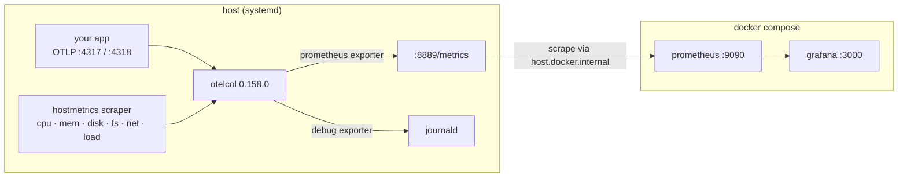

# otel-stack

A local OpenTelemetry playground: an OpenTelemetry Collector running on the host,
scraping host metrics, exposed to a containerised Prometheus + Grafana.

Used for discovery-driven instrumentation experiments — send OTLP at it, watch what
comes out the other end.

## Architecture



The collector is **not** containerised — it runs on the host so `hostmetrics` sees the
real machine rather than a container namespace. Prometheus reaches back out to it via
`host.docker.internal`, mapped to the docker bridge gateway by `extra_hosts`.

## Layout

```
docker-compose.yaml                          prometheus + grafana
prometheus.yaml                              scrape config
collector/otelcol_0.158.0_linux_amd64.deb    collector package (installed to the host)
grafana/provisioning/datasources/            prometheus datasource
grafana/provisioning/dashboards/             dashboard provider
grafana/dashboards/hostmetrics.json          "OTel Host Metrics" dashboard
```

The live collector config is **not** in this repo — it lives at `/etc/otelcol/config.yaml`
on the host (see [Collector](#collector) below).

## Setup

### Collector

```bash
sudo dpkg -i collector/otelcol_0.158.0_linux_amd64.deb
sudo systemctl enable --now otelcol
systemctl status otelcol
```

Config at `/etc/otelcol/config.yaml`. The pipelines currently are:

| Pipeline | Receivers | Exporters |
|---|---|---|
| metrics | otlp, prometheus (self, `:8888`), hostmetrics | debug, **prometheus (`:8889`)** |
| traces  | otlp, jaeger, zipkin | debug |
| logs    | otlp | debug |

Only **metrics** reach Prometheus. Traces and logs are accepted but go to the `debug`
exporter only — they are printed to the journal and then dropped. See
[Limitations](#limitations).

After editing the config:

```bash
sudo systemctl restart otelcol
journalctl -u otelcol -f
```

### Firewall

Prometheus runs in a container and scrapes the collector on the **host**. If `ufw` is
active it drops bridge → host traffic by default, and the target sits at `DOWN` with
`context deadline exceeded`:

```bash
sudo ufw allow from 192.168.48.0/20 to any port 8889 proto tcp
```

`192.168.48.0/20` is pinned in `docker-compose.yaml` (`networks.default.ipam`) precisely
so this rule keeps working — without the pin, Docker reassigns the subnet whenever the
network is recreated and the rule silently stops matching.

### Stack

```bash
docker compose up -d
```

| Service | URL | Notes |
|---|---|---|
| Grafana | http://localhost:3000 | `admin` / `admin` on a fresh volume |
| Prometheus | http://localhost:9090 | |
| Collector metrics | http://localhost:8889/metrics | what Prometheus scrapes |
| Collector self-telemetry | http://localhost:8888/metrics | bound to `127.0.0.1` |
| zpages | http://localhost:55679/debug/tracez | |

The Grafana admin password only seeds on a **fresh** `grafana-data` volume; changing
`GF_SECURITY_ADMIN_PASSWORD` later has no effect.

### Verify

```bash
# collector is exporting
curl -s localhost:8889/metrics | grep -c '^system_'

# prometheus is scraping it
curl -s 'localhost:9090/api/v1/query?query=up{job="otel-collector-hostmetrics"}'
```

## Dashboard

`grafana/dashboards/hostmetrics.json` is provisioned automatically into the **OTel**
folder as *OTel Host Metrics* — 22 panels covering CPU, memory, disk, filesystem and
network. `allowUiUpdates: true`, so UI edits stick rather than being reverted.

It can also be imported by hand (Dashboards → Import); the datasource is a template
variable, not a hardcoded UID, so it is portable.

Template variables `$disk`, `$netdev` and `$mount` filter out the noise — snap `loop*`
devices, `squashfs` mounts and docker `br-*` interfaces, which otherwise account for the
bulk of the 84 disk and 114 filesystem series.

## Metric naming, and how to query it

These are **OpenTelemetry semantic-convention** names, not node_exporter names. Community
node_exporter dashboards from grafana.com will import cleanly and then render nothing.

| | |
|---|---|
| `system_cpu_time_seconds_total` | counter, label `state` |
| `system_cpu_logical_count` | core count |
| `system_cpu_load_average_{1m,5m,15m}` | |
| `system_memory_usage_bytes` | label `state` |
| `system_disk_{io_bytes,operations,io_time_seconds}_total` | labels `device`, `direction` |
| `system_filesystem_{usage_bytes,inodes_usage}` | labels `mountpoint`, `state`, `type` |
| `system_network_{io_bytes,packets,errors,dropped}_total` | labels `device`, `direction` |
| `system_network_connections` | labels `protocol`, `state` |

Three pitfalls, all of which have already produced wrong dashboards here:

**There is no `cpu` label.** The hostmetrics scraper aggregates across cores, so the
node_exporter idiom `count(count by(cpu)(system_cpu_time_seconds_total))` returns `1`,
not your core count. Anything normalised by it is wrong by a factor of `ncores` — it
renders as a *negative* CPU percentage. Use `system_cpu_logical_count`:

```promql
100 * (1 - rate(system_cpu_time_seconds_total{state="idle"}[$__rate_interval])
           / scalar(system_cpu_logical_count))
```

**Memory states overlap.** `cached` already contains `slab_reclaimable`, so
`sum(system_memory_usage_bytes)` over all states double-counts and overstates total RAM
by several GB. Stack only `used|free|buffered|cached`.

**There is no exact memory total.** OTel defines `used` as `MemTotal - MemAvailable`,
which deliberately overlaps the reclaimable states, so no combination of states sums to
`MemTotal`. Absolute `used` bytes are exact; any derived percentage is an approximation.
For an exact ratio, enable the utilization metrics (off by default):

```yaml
  hostmetrics:
    scrapers:
      cpu:
        metrics:
          system.cpu.utilization: {enabled: true}
      memory:
        metrics:
          system.memory.utilization: {enabled: true}
```

Note also that filesystem percentages differ from `df`: this metric's denominator
includes root-reserved blocks, `df`'s does not, so `df` reads a few points higher.

## Troubleshooting

**Grafana unreachable although the container is `Up`.** Port mappings are fixed at
container *creation*. Adding `ports:` to the compose file does nothing to a running
container, and `docker restart` will not pick it up — `docker compose up -d` is what
reconciles it. Check with `docker port grafana`.

**Prometheus ignores `prometheus.yaml`.** The image's default is
`--config.file=/etc/prometheus/prometheus.yml` — note `.yml`. Mounting a `.yaml` file
leaves both present in the container and Prometheus silently loads its own default,
which only scrapes itself. The compose file therefore passes `--config.file` explicitly.
Confirm what is actually loaded with `curl -s localhost:9090/api/v1/status/config`.

**Target `DOWN`, `context deadline exceeded`.** A *timeout* rather than a connection
refusal points at a firewall drop, not a dead process. See [Firewall](#firewall).

**Panels empty right after a fix.** `rate()` needs at least two samples in its window.
Immediately after the scrape starts working, a `[5m]` rate spanning the outage reads low
or empty; it settles once history fills in.

## Limitations

- **Traces and logs are not stored.** Both pipelines end at the `debug` exporter. Add
  Jaeger/Tempo and Loki to persist them.
- **`debug` has `verbosity: detailed`** on every pipeline — every point is written to the
  journal. Fine for a playground, expensive under load; drop the exporter or lower the
  verbosity before pushing real traffic through it.
- **Single host, no auth, no TLS, no retention tuning.** Local experimentation only.
