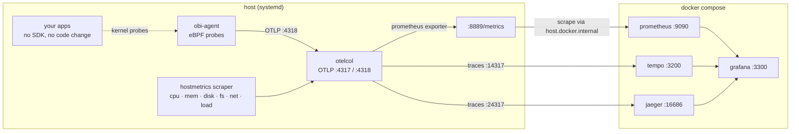

# otel-stack

A local OpenTelemetry playground: an OpenTelemetry Collector on the host collecting
host metrics and OTLP, fanning traces out to Tempo and Jaeger, with Prometheus and
Grafana alongside. Applications are instrumented with zero code changes by OBI
(OpenTelemetry eBPF Instrumentation).

Used for discovery-driven instrumentation experiments — send OTLP at it, watch what
comes out the other end.

## Architecture



Three things about this shape are deliberate.

**The collector is not containerised.** It runs on the host so `hostmetrics` sees the
real machine rather than a container namespace. Prometheus reaches back out to it via
`host.docker.internal`, mapped to the docker bridge gateway by `extra_hosts`.

**Traces fan out.** A pipeline's `exporters` list delivers every span to every exporter
independently, so Tempo and Jaeger each receive a full copy and neither knows about the
other. That is also how you would migrate backends with no downtime: add the new
exporter, run both, compare, drop the old one.

**Apps are never modified.** OBI attaches eBPF probes in the kernel, so a binary with no
OpenTelemetry SDK compiled in still produces traces. Everything sends to one address —
the collector on `:4318` — because OTLP carries the signal type in the request path
(`/v1/traces`, `/v1/metrics`), and the collector's pipelines route from there.

Backend ports are remapped (Tempo `14317`, Jaeger `24317`) because the host collector
already owns the standard `4317`/`4318`.

## Layout

```
docker-compose.yaml                          prometheus · grafana · tempo · jaeger
prometheus.yaml                              scrape config
tempo/tempo.yaml                             tempo config (OTLP in, local storage)
install-otelcol-obi.sh                       bootstrap: collector + OBI on a bare host
collector/config.yaml                        collector config, installed by that script
collector/otelcol_*.deb                      pinned collector package
grafana/provisioning/datasources/            prometheus · tempo · jaeger datasources
grafana/provisioning/dashboards/             dashboard provider
grafana/dashboards/hostmetrics.json          "OTel Host Metrics" dashboard
grafana/dashboards/red-services.json         "Service RED Metrics" dashboard
mw-injector/                                 vendored discovery library + mw-obi CLI
                                             (nested git repo, gitignored)
```

Host-side pieces are **not** in this repo: `otelcol`, `obi-agent` and the demo apps all
run as systemd units. `collector/config.yaml` is the versioned copy of what belongs at
`/etc/otelcol/config.yaml`; the OBI config at `/etc/obi-agent/config.yaml` has no
tracked counterpart.

## Setup

### Collector

```bash
sudo dpkg -i collector/otelcol_0.158.0_linux_amd64.deb
sudo systemctl enable --now otelcol
systemctl status otelcol
```

Config at `/etc/otelcol/config.yaml`. The pipelines currently are:

| Pipeline | Receivers | Exporters |
|---|---|---|
| metrics | otlp, prometheus (self, `:8888`), hostmetrics | debug, **prometheus (`:8889`)** |
| traces  | otlp, jaeger, zipkin | **otlp/tempo**, **otlp/jaeger** |
| logs    | otlp | debug |

Metrics reach Prometheus by being exposed on `:8889` and scraped; traces are pushed to
both backends. **Logs** are still accepted and dropped — they end at `debug`, printed to
the journal. See [Limitations](#limitations).

An exporter must be both *defined* under `exporters:` and *referenced* in a pipeline.
Defining one without referencing it is ignored silently; referencing one that is not
defined is a hard failure that takes the whole collector down:

```
Error: invalid configuration: service::pipelines::traces:
       references exporter "otlp/jaeger" which is not configured
```

After editing the config:

```bash
sudo systemctl restart otelcol
journalctl -u otelcol -f
```

### Firewall

Prometheus runs in a container and scrapes the collector on the **host**. If `ufw` is
active it drops bridge → host traffic by default, and the target sits at `DOWN` with
`context deadline exceeded`:

```bash
sudo ufw allow from 192.168.48.0/20 to any port 8889 proto tcp
```

`192.168.48.0/20` is pinned in `docker-compose.yaml` (`networks.default.ipam`) precisely
so this rule keeps working — without the pin, Docker reassigns the subnet whenever the
network is recreated and the rule silently stops matching.

### Stack

```bash
docker compose up -d
```

| Service | URL | Notes |
|---|---|---|
| Grafana | http://localhost:3300 | `admin` / `admin` on a fresh volume |
| Jaeger | http://localhost:16686 | no auth; trace search UI |
| Prometheus | http://localhost:9090 | |
| Tempo | http://localhost:3200 | query API — view traces via Grafana Explore |
| Collector metrics | http://localhost:8889/metrics | what Prometheus scrapes |
| Collector self-telemetry | http://localhost:8888/metrics | bound to `127.0.0.1` |
| zpages | http://localhost:55679/debug/tracez | |

Grafana is on **3300**, not the usual 3000 — a host process already owns 3000 here, and
Docker silently leaves the mapping off rather than failing loudly. `docker port grafana`
tells you what actually got bound.

The Grafana admin password only seeds on a **fresh** `grafana-data` volume; changing
`GF_SECURITY_ADMIN_PASSWORD` later has no effect.

### Verify

```bash
# collector is exporting host metrics
curl -s localhost:8889/metrics | grep -c '^system_'

# prometheus is scraping it
curl -s 'localhost:9090/api/v1/query?query=up{job="otel-collector-hostmetrics"}'

# spans arriving, and leaving to both backends (the three counts should match)
curl -s localhost:8889/metrics | grep -E 'otelcol_(receiver_accepted|exporter_sent)_spans'

# what each backend has actually stored
curl -s localhost:16686/api/services
curl -s 'localhost:3200/api/v2/search/tag/resource.service.name/values'
```

The span counters are the fastest way to localise a break: nothing on the receiver means
the problem is upstream of the collector (OBI), while a receiver count with no exporter
count means the problem is downstream.

## Instrumenting services with `mw-obi`

`mw-injector/cmd/mw-obi` is a small OBI-only CLI over the
[mw-injector](https://github.com/middleware-labs/java-injector) library. It discovers
processes on the host and writes OBI selectors into `/etc/obi-agent/config.yaml`, so
instrumented services start emitting without any code change or restart of the app.

Build once:

```bash
cd mw-injector && go build -o builds/mw-obi ./cmd/mw-obi
```

Everything needs root — discovery reads other users' `/proc`, and instrumenting
writes the OBI config and restarts `obi-agent`.

| Command | Does |
|---|---|
| `sudo ./builds/mw-obi list` | Discover every service, grouped by fingerprint |
| `sudo ./builds/mw-obi list --language go` | Filter to one language |
| `sudo ./builds/mw-obi list --json` | Machine-readable, for scripting |
| `sudo ./builds/mw-obi selectors` | Show selectors already in the OBI config |
| `sudo ./builds/mw-obi instrument <name> --language <l>` | Add a selector, restart obi-agent |
| `sudo ./builds/mw-obi instrument-all --language <l>` | Instrument every service of a language |
| `sudo ./builds/mw-obi uninstrument <name>` | Remove the selector again |

A typical loop — list, read the language column, instrument, confirm:

```bash
sudo ./builds/mw-obi list
sudo ./builds/mw-obi instrument demo-golang-app --language go
sudo ./builds/mw-obi selectors
```

`list` prints service name, language, service type, ports, PIDs, whether it is already
instrumented (and via what), and a short fingerprint:

```
SERVICE                LANG    TYPE     PORTS  INSTRUMENTED   FINGERPRINT
demo-golang-app        go      systemd  6060   yes (obi)      375a5e6fd25d
demo-ruby-service      ruby    systemd  3001   no             bf2bdd9efdf3
fastapi-bookstore-api  python  systemd  8000   no             424e0d83a8bd
```

Both `instrument` and `uninstrument` accept a **fingerprint** instead of a name, which
is how you disambiguate two services sharing a name. The fingerprint is a stable hash of
the executable path plus language-specific args — deliberately excluding ports, so it
survives restarts and is shared by every replica of the same app.

Things worth knowing:

- **`--language` is mandatory for `instrument`.** The underlying API filters discovery by
  language before matching the name. Run `list` first and read it off.
- **This CLI only ever uses OBI.** It calls the OBI API directly and never builds a
  `StrategyRegistry`, so `SystemdDropinStrategy` cannot fire. That matters: the drop-in
  strategy hardcodes `OTEL_EXPORTER_OTLP_ENDPOINT=http://localhost:9319` (the Middleware
  agent), which is wrong for this stack. Export targets stay in `otel_traces_export` in
  the OBI config, and mw-injector never touches them.
- **A selector is not data.** OBI is request-driven, so an instrumented but idle service
  emits nothing. Send traffic before concluding something is broken.
- **Selectors match on language + ports.** If two services of the same language share a
  port, one selector can capture both; narrow it with `exe_path` in the OBI config.

Verify after instrumenting:

```bash
curl -s localhost:8889/metrics | grep otelcol_receiver_accepted_spans   # reaching the collector
curl -s localhost:16686/api/services                                    # visible in Jaeger
```

## Dashboard

Two dashboards are provisioned automatically into the **OTel** folder:

| File | Dashboard | Covers |
|---|---|---|
| `grafana/dashboards/hostmetrics.json` | *OTel Host Metrics* | CPU, memory, disk, filesystem, network — 22 panels |
| `grafana/dashboards/red-services.json` | *Service RED Metrics* | rate, errors, duration per service and route, from OBI's `http_server_*` metrics |

`allowUiUpdates: true`, so UI edits stick rather than being reverted.

It can also be imported by hand (Dashboards → Import); the datasource is a template
variable, not a hardcoded UID, so it is portable.

Traces are not dashboarded — that is what Grafana **Explore** is for. Pick the Tempo
datasource, search by service, and read the waterfall; or use the Jaeger UI directly.
Dashboards cover the aggregate (which route is slow), traces answer the individual
(why that request was).

Template variables `$disk`, `$netdev` and `$mount` filter out the noise — snap `loop*`
devices, `squashfs` mounts and docker `br-*` interfaces, which otherwise account for the
bulk of the 84 disk and 114 filesystem series.

## Metric naming, and how to query it

These are **OpenTelemetry semantic-convention** names, not node_exporter names. Community
node_exporter dashboards from grafana.com will import cleanly and then render nothing.

| | |
|---|---|
| `system_cpu_time_seconds_total` | counter, label `state` |
| `system_cpu_logical_count` | core count |
| `system_cpu_load_average_{1m,5m,15m}` | |
| `system_memory_usage_bytes` | label `state` |
| `system_disk_{io_bytes,operations,io_time_seconds}_total` | labels `device`, `direction` |
| `system_filesystem_{usage_bytes,inodes_usage}` | labels `mountpoint`, `state`, `type` |
| `system_network_{io_bytes,packets,errors,dropped}_total` | labels `device`, `direction` |
| `system_network_connections` | labels `protocol`, `state` |

Three pitfalls, all of which have already produced wrong dashboards here:

**There is no `cpu` label.** The hostmetrics scraper aggregates across cores, so the
node_exporter idiom `count(count by(cpu)(system_cpu_time_seconds_total))` returns `1`,
not your core count. Anything normalised by it is wrong by a factor of `ncores` — it
renders as a *negative* CPU percentage. Use `system_cpu_logical_count`:

```promql
100 * (1 - rate(system_cpu_time_seconds_total{state="idle"}[$__rate_interval])
           / scalar(system_cpu_logical_count))
```

**Memory states overlap.** `cached` already contains `slab_reclaimable`, so
`sum(system_memory_usage_bytes)` over all states double-counts and overstates total RAM
by several GB. Stack only `used|free|buffered|cached`.

**There is no exact memory total.** OTel defines `used` as `MemTotal - MemAvailable`,
which deliberately overlaps the reclaimable states, so no combination of states sums to
`MemTotal`. Absolute `used` bytes are exact; any derived percentage is an approximation.
For an exact ratio, enable the utilization metrics (off by default):

```yaml
  hostmetrics:
    scrapers:
      cpu:
        metrics:
          system.cpu.utilization: {enabled: true}
      memory:
        metrics:
          system.memory.utilization: {enabled: true}
```

Note also that filesystem percentages differ from `df`: this metric's denominator
includes root-reserved blocks, `df`'s does not, so `df` reads a few points higher.

## Troubleshooting

**Grafana unreachable although the container is `Up`.** Port mappings are fixed at
container *creation*. Adding `ports:` to the compose file does nothing to a running
container, and `docker restart` will not pick it up — `docker compose up -d` is what
reconciles it. Check with `docker port grafana`.

**Prometheus ignores `prometheus.yaml`.** The image's default is
`--config.file=/etc/prometheus/prometheus.yml` — note `.yml`. Mounting a `.yaml` file
leaves both present in the container and Prometheus silently loads its own default,
which only scrapes itself. The compose file therefore passes `--config.file` explicitly.
Confirm what is actually loaded with `curl -s localhost:9090/api/v1/status/config`.

**Target `DOWN`, `context deadline exceeded`.** A *timeout* rather than a connection
refusal points at a firewall drop, not a dead process. See [Firewall](#firewall).

**Panels empty right after a fix.** `rate()` needs at least two samples in its window.
Immediately after the scrape starts working, a `[5m]` rate spanning the outage reads low
or empty; it settles once history fills in.

## Limitations

- **Logs are not stored.** The logs pipeline still ends at `debug`. Add Loki to persist
  them; traces and metrics are handled.
- **Jaeger storage is in-memory.** Its traces vanish on `docker compose restart jaeger`,
  while Tempo's persist in the `tempo-data` volume. That is the sharpest practical
  difference between the two backends here.
- **`debug` has `verbosity: detailed`** — every point on a pipeline using it is written to
  the journal. Fine for a playground, expensive under load; drop the exporter or lower
  the verbosity before pushing real traffic through it.
- **No metric→trace correlation.** Exemplars and a service graph both need span metrics
  (the `spanmetrics` connector, or Tempo's metrics-generator); neither is enabled, so
  moving from a latency spike to the trace behind it is a manual search.
- **Single host, no auth, no TLS, no retention tuning.** Local experimentation only.
